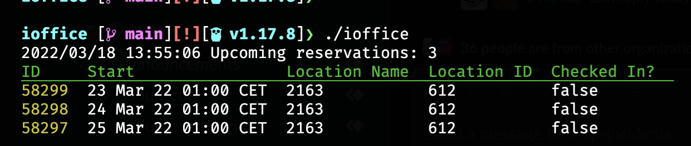

# iOffice CLI Reservation Tool

Lists and creates reservations of spaces

## Usage

1. `cp ioffice.example.yaml ioffice.yaml`
2. Set your username and password from the iOffice app
3. Set your instance's hostname (`example` in https://example.ioffice.com)
4. Run the application to get a list of your future bookings (`go run .` or `./ioffice`)
5. Book a named room by passing in a date and a room (`go run . 2022-03-13 2101` or `./ioffice 2022-03-13 2102`)
6. From your list of reservations, take the room ID of the desk you prefer and put it into ioffice.yaml
7. Now you can also reserve this desk for a full day without passing in the number (`go run . 2022-03-13` or `./ioffice 2022-03-13`)

## Development

To release a new version:

1. Get your code into the main branch (via a PR if you're not a collaborator, ideally conventional commit messages)
2. Create a git tag with the new desired version number (follow SemVer)
3. Push your git tag (`git push --tags`)
4. Go Releaser will create a new release
5. If you're happy the release is stable, change it from a pre-release to a full release